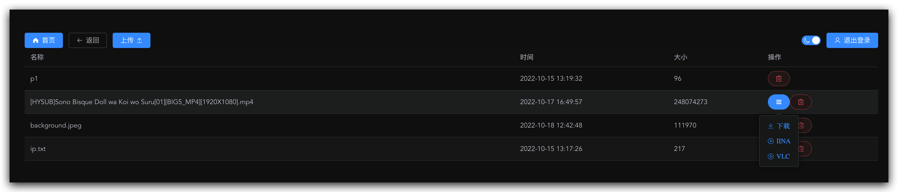
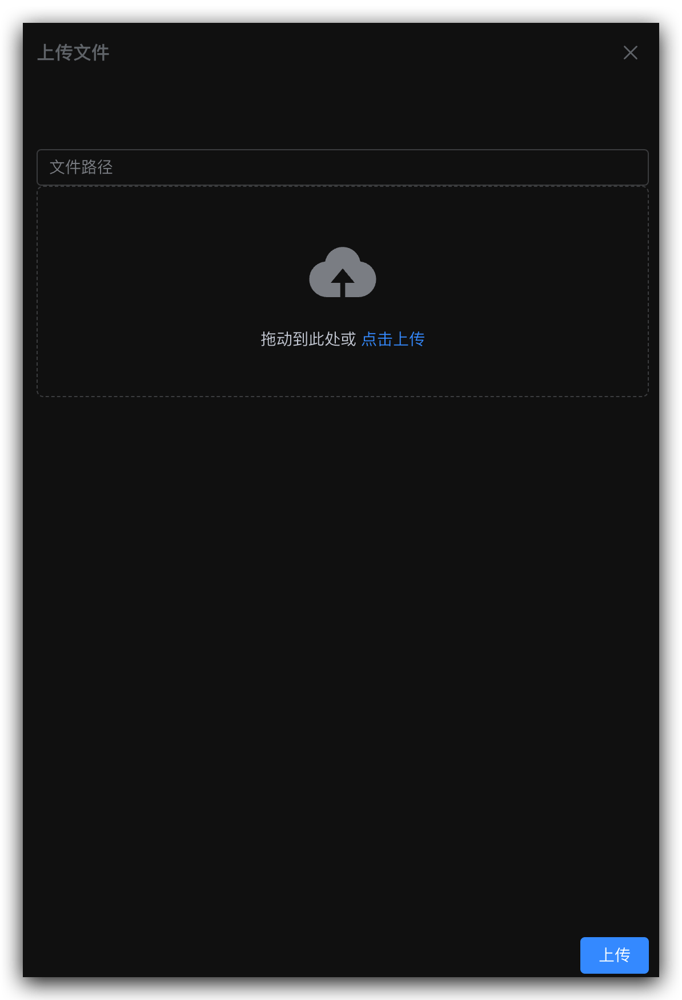

# python3 fastapi 实现的简易网盘，支持流媒体播放

## 已完成

- [x] 文件列表
- [x] 文件上传
- [x] 文件下载
- [x] 流媒体播放

## TODO

- [ ] 下载链接临时密码
- [ ] 流媒体播放临时密码

## 图片





## 开发

```bash
cp .env.example .env
python3 -m venv ./venv
./venv/bin/python3 -m pip install -r requirements.txt
./venv/bin/python3 -m uvicorn main:app
```

```bash
cd front
yarn
yarn serve
```
